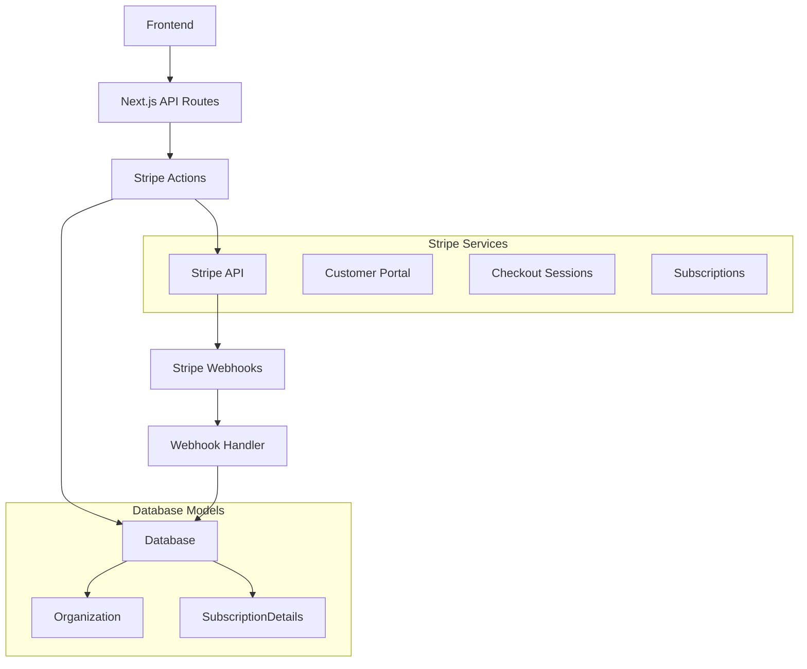

# Design Document

## Overview

Este documento detalha o design para melhorar a integração do Stripe, implementando um período de teste gratuito de 7 dias, melhor rastreamento de assinaturas e configuração aprimorada. A solução utilizará recursos nativos do Stripe como trial periods, webhooks avançados e customer portal.

## Architecture

### High-Level Architecture



### Data Flow

1. **Trial Subscription Creation**: Usuário inicia checkout → Stripe cria subscription com trial → Webhook atualiza database
2. **Trial to Paid Conversion**: Trial expira → Stripe cobra automaticamente → Webhook confirma pagamento
3. **Subscription Management**: Usuário acessa portal → Stripe gerencia mudanças → Webhooks sincronizam

## Components and Interfaces

### Database Schema Extensions

```typescript
// Extensão do modelo Organization
model Organization {
  // ... campos existentes
  
  // Novos campos para trial
  trialStartDate    DateTime?
  trialEndDate      DateTime?
  trialUsed         Boolean   @default(false)
  
  // Campos detalhados de assinatura
  subscriptionStatus       String?
  currentPeriodStart      DateTime?
  currentPeriodEnd        DateTime?
  cancelAtPeriodEnd       Boolean   @default(false)
  lastPaymentDate         DateTime?
  nextBillingDate         DateTime?
  paymentMethodLast4      String?
  paymentMethodBrand      String?
}
```

### Stripe Configuration

```typescript
// Configuração de produtos no Stripe
interface StripeProducts {
  PRO_MONTHLY: {
    priceId: string;
    trialPeriodDays: 7;
    features: string[];
  }
}

// Configuração de webhooks necessários
const REQUIRED_WEBHOOKS = [
  'customer.subscription.created',
  'customer.subscription.updated', 
  'customer.subscription.deleted',
  'customer.subscription.trial_will_end',
  'invoice.payment_succeeded',
  'invoice.payment_failed'
];
```

### Enhanced Stripe Actions

```typescript
// Ação para criar checkout com trial
export async function createTrialCheckoutSession(organizationId: string): Promise<{url: string}>

// Ação para verificar status do trial
export async function getTrialStatus(organizationId: string): Promise<TrialStatus>

// Ação para obter detalhes completos da assinatura
export async function getSubscriptionDetails(organizationId: string): Promise<SubscriptionDetails>
```

## Data Models

### TrialStatus Interface

```typescript
interface TrialStatus {
  isInTrial: boolean;
  trialStartDate: Date | null;
  trialEndDate: Date | null;
  daysRemaining: number;
  hasUsedTrial: boolean;
}
```

### SubscriptionDetails Interface

```typescript
interface SubscriptionDetails {
  status: 'active' | 'trialing' | 'past_due' | 'canceled' | 'unpaid';
  currentPeriodStart: Date;
  currentPeriodEnd: Date;
  cancelAtPeriodEnd: boolean;
  trialEnd: Date | null;
  lastPaymentDate: Date | null;
  nextBillingDate: Date | null;
  paymentMethod: {
    last4: string;
    brand: string;
    expiryMonth: number;
    expiryYear: number;
  } | null;
  upcomingInvoice: {
    amount: number;
    currency: string;
    date: Date;
  } | null;
}
```

## Error Handling

### Trial-Specific Errors

```typescript
class TrialError extends Error {
  constructor(
    message: string,
    public code: 'TRIAL_ALREADY_USED' | 'TRIAL_EXPIRED' | 'INVALID_TRIAL_STATE'
  ) {
    super(message);
  }
}
```

### Webhook Error Handling

- Implementar retry logic para webhooks falhados
- Logging detalhado de todos os eventos de webhook
- Alertas para eventos críticos não processados
- Validação de assinatura de webhook aprimorada

## Testing Strategy

### Unit Tests

- Testes para lógica de cálculo de trial
- Testes para processamento de webhooks
- Testes para validação de configuração do Stripe
- Mocks para chamadas da API do Stripe

### Integration Tests

- Testes end-to-end do fluxo de trial
- Testes de sincronização de webhooks
- Testes do customer portal
- Testes de cenários de falha de pagamento

### Manual Testing Checklist

1. **Trial Flow**:
   - [ ] Criar nova organização e iniciar trial
   - [ ] Verificar acesso às funcionalidades Pro durante trial
   - [ ] Confirmar cobrança automática após trial
   - [ ] Testar cancelamento durante trial

2. **Webhook Processing**:
   - [ ] Usar Stripe CLI para simular webhooks
   - [ ] Verificar sincronização de dados
   - [ ] Testar cenários de falha

3. **Customer Portal**:
   - [ ] Acessar portal do cliente
   - [ ] Atualizar método de pagamento
   - [ ] Cancelar assinatura
   - [ ] Verificar sincronização

## Implementation Phases

### Phase 1: Database and Core Logic
- Atualizar schema do Prisma
- Implementar lógica de trial
- Criar interfaces TypeScript

### Phase 2: Stripe Integration
- Configurar produtos com trial no Stripe
- Atualizar checkout sessions
- Implementar webhooks avançados

### Phase 3: UI/UX Improvements
- Atualizar componente de subscription manager
- Adicionar indicadores de trial
- Melhorar exibição de informações de assinatura

### Phase 4: Configuration and Documentation
- Criar scripts de configuração
- Documentar variáveis de ambiente
- Implementar validação de configuração

## Security Considerations

- Validação rigorosa de webhooks do Stripe
- Rate limiting para endpoints de checkout
- Logging de auditoria para mudanças de assinatura
- Proteção contra uso múltiplo de trial pela mesma organização
- Validação de permissões para gerenciamento de assinatura