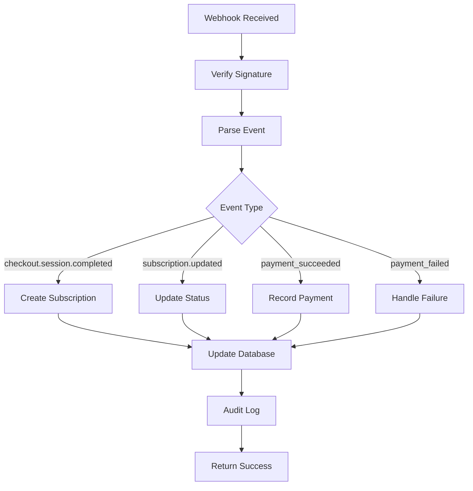

# Stripe Integration - Comprehensive Guide

This comprehensive guide covers the complete Stripe integration including trial periods, subscription management, webhooks, and troubleshooting.

## 📋 Table of Contents

1. [Overview](#overview)
2. [Trial Period System](#trial-period-system)
3. [Subscription Management](#subscription-management)
4. [Webhook Processing](#webhook-processing)
5. [Customer Portal](#customer-portal)
6. [Error Handling](#error-handling)
7. [Testing Guide](#testing-guide)
8. [Deployment Checklist](#deployment-checklist)
9. [Troubleshooting](#troubleshooting)
10. [Monitoring](#monitoring)

## Overview

The Stripe integration provides:
- **7-day free trial** for new Pro subscriptions
- **Comprehensive subscription management** with detailed status tracking
- **Robust webhook processing** for real-time synchronization
- **Customer portal integration** for self-service management
- **Advanced error handling** with specific error types and recovery
- **Complete audit logging** for compliance and debugging

### Key Features

- ✅ Trial eligibility checking (prevents multiple trials)
- ✅ Automatic trial-to-paid conversion
- ✅ Real-time subscription status updates
- ✅ Payment method management through customer portal
- ✅ Comprehensive error handling and logging
- ✅ Health monitoring and configuration validation

## Trial Period System

### How Trials Work

1. **Eligibility Check**: System verifies organization hasn't used trial before
2. **Trial Creation**: 7-day trial period starts immediately upon checkout
3. **Trial Tracking**: Database tracks trial start/end dates and usage
4. **Automatic Conversion**: After 7 days, subscription automatically converts to paid
5. **Trial Notifications**: Users receive notifications about trial status

### Trial Eligibility Rules

An organization is eligible for a trial if:
- ✅ Has never used a trial before (`trialUsed = false`)
- ✅ Doesn't have an active Pro subscription
- ✅ Is not currently in a trial period

### Trial Status Tracking

```typescript
interface TrialStatus {
  isInTrial: boolean;           // Currently in trial period
  trialStartDate: Date | null;  // When trial started
  trialEndDate: Date | null;    // When trial ends
  daysRemaining: number;        // Days left in trial
  hasUsedTrial: boolean;        // Has ever used trial
}
```

### Database Schema for Trials

```sql
-- Organization table extensions
ALTER TABLE Organization ADD COLUMN trialStartDate DATETIME;
ALTER TABLE Organization ADD COLUMN trialEndDate DATETIME;
ALTER TABLE Organization ADD COLUMN trialUsed BOOLEAN DEFAULT FALSE;
ALTER TABLE Organization ADD COLUMN subscriptionStatus VARCHAR(50);
ALTER TABLE Organization ADD COLUMN currentPeriodStart DATETIME;
ALTER TABLE Organization ADD COLUMN currentPeriodEnd DATETIME;
ALTER TABLE Organization ADD COLUMN cancelAtPeriodEnd BOOLEAN DEFAULT FALSE;
ALTER TABLE Organization ADD COLUMN lastPaymentDate DATETIME;
ALTER TABLE Organization ADD COLUMN nextBillingDate DATETIME;
ALTER TABLE Organization ADD COLUMN paymentMethodLast4 VARCHAR(4);
ALTER TABLE Organization ADD COLUMN paymentMethodBrand VARCHAR(20);
```

## Subscription Management

### Subscription Lifecycle

1. **Trial Creation** → `checkout.session.completed` with trial
2. **Trial Active** → User has full Pro access for 7 days
3. **Trial Ending** → `customer.subscription.trial_will_end` (2 days before)
4. **First Payment** → `invoice.payment_succeeded` (trial converts to paid)
5. **Active Subscription** → Regular billing cycle begins
6. **Cancellation** → `customer.subscription.deleted` or period end

### Subscription Status Values

| Status | Description | User Access |
|--------|-------------|-------------|
| `trialing` | In 7-day trial period | Full Pro access |
| `active` | Paid and current | Full Pro access |
| `past_due` | Payment failed | Limited access |
| `canceled` | Subscription ended | Free access only |
| `unpaid` | Multiple payment failures | No access |

### Subscription Details Interface

```typescript
interface SubscriptionDetails {
  status: 'active' | 'trialing' | 'past_due' | 'canceled' | 'unpaid';
  currentPeriodStart: Date;
  currentPeriodEnd: Date;
  cancelAtPeriodEnd: boolean;
  trialEnd: Date | null;
  lastPaymentDate: Date | null;
  nextBillingDate: Date | null;
  paymentMethod: {
    last4: string;
    brand: string;
    expiryMonth: number;
    expiryYear: number;
  } | null;
  upcomingInvoice: {
    amount: number;
    currency: string;
    date: Date;
  } | null;
}
```

## Webhook Processing

### Required Webhook Events

Configure these events in your Stripe Dashboard:

| Event | Purpose | Handler |
|-------|---------|---------|
| `checkout.session.completed` | Trial/subscription creation | Creates Pro subscription with trial |
| `customer.subscription.created` | Subscription created | Updates organization status |
| `customer.subscription.updated` | Subscription changes | Syncs subscription data |
| `customer.subscription.trial_will_end` | Trial ending soon | Sends notifications |
| `invoice.payment_succeeded` | Successful payment | Updates payment status |
| `invoice.payment_failed` | Failed payment | Handles payment failures |
| `customer.subscription.deleted` | Subscription canceled | Reverts to free plan |

### Webhook Processing Flow



### Webhook Security

- ✅ Signature verification using `STRIPE_WEBHOOK_SECRET`
- ✅ Timestamp validation (default 5-minute tolerance)
- ✅ Idempotency handling for duplicate events
- ✅ Comprehensive error logging
- ✅ Retry logic for failed processing

## Customer Portal

### Portal Features

The customer portal allows users to:
- 📄 View subscription details and billing history
- 💳 Update payment methods
- 📧 Change billing email and address
- 📋 Download invoices
- ❌ Cancel subscriptions (with trial-aware logic)

### Portal Configuration

The system creates different portal configurations based on subscription state:

#### Trial Configuration
- **Cancellation**: Immediate (no period end)
- **Payment Methods**: Limited updates
- **Billing**: View-only during trial

#### Active Subscription Configuration
- **Cancellation**: At period end
- **Payment Methods**: Full management
- **Billing**: Complete access

### Portal Integration Flow

1. **Portal Access** → User clicks "Manage Subscription"
2. **Session Creation** → System creates Stripe portal session
3. **Portal Usage** → User manages subscription in Stripe portal
4. **Return Handling** → System syncs changes upon return
5. **Data Sync** → Subscription data updated in database

## Error Handling

### Error Types

The system includes specialized error classes for different scenarios:

#### Trial Errors
- `TrialAlreadyUsedError` - Organization already used trial
- `TrialNotEligibleError` - Not eligible for trial
- `TrialExpiredError` - Trial period has ended
- `InvalidTrialStateError` - Inconsistent trial data

#### Subscription Errors
- `SubscriptionNotFoundError` - No subscription exists
- `SubscriptionAlreadyExistsError` - Active subscription exists
- `PaymentFailedError` - Payment processing failed

#### Webhook Errors
- `WebhookSignatureError` - Invalid webhook signature
- `WebhookProcessingError` - Failed to process webhook

#### API Errors
- `StripeApiError` - Stripe API communication error
- `StripeConfigurationError` - Invalid configuration

### Error Recovery

```typescript
// Example error handling
try {
  await createCheckoutSession(organizationId);
} catch (error) {
  if (error instanceof TrialAlreadyUsedError) {
    // Show trial already used message
    return { error: error.getUserMessage() };
  } else if (error instanceof StripeApiError) {
    // Log error and show generic message
    logger.error('Stripe API error', error);
    return { error: 'Payment system temporarily unavailable' };
  }
  throw error; // Re-throw unexpected errors
}
```

## Testing Guide

### End-to-End Test Coverage

The test suite covers:

✅ **Trial Signup Flow**
- Eligible organization creates trial subscription
- Ineligible organization gets appropriate error
- Trial eligibility validation logic

✅ **Trial to Paid Conversion**
- Webhook processing for trial completion
- Payment success handling
- Trial expiration notifications

✅ **Subscription Management**
- Customer portal session creation
- Portal return data synchronization
- Subscription status updates

✅ **Error Scenarios**
- Invalid webhook signatures
- Payment failures
- API communication errors

### Running Tests

```bash
# Run all Stripe integration tests
npm test src/test/stripe/ --run

# Run specific test suites
npm test src/test/stripe/stripe-e2e.test.ts --run

# Run with coverage
npm test -- --coverage src/test/stripe/
```

### Test Data

Use Stripe's test card numbers:

| Card Number | Result |
|-------------|--------|
| `4242 4242 4242 4242` | Success |
| `4000 0000 0000 0002` | Card declined |
| `4000 0025 0000 3155` | 3D Secure required |
| `4000 0000 0000 9995` | Insufficient funds |

### Manual Testing Checklist

#### Trial Flow Testing
- [ ] Create new organization
- [ ] Start Pro trial subscription
- [ ] Verify 7-day trial period
- [ ] Check trial status in UI
- [ ] Test trial expiration handling
- [ ] Verify automatic conversion to paid

#### Subscription Management Testing
- [ ] Access customer portal
- [ ] Update payment method
- [ ] View billing history
- [ ] Cancel subscription
- [ ] Verify data synchronization

#### Webhook Testing
- [ ] Use Stripe CLI to trigger events
- [ ] Verify webhook processing logs
- [ ] Test signature validation
- [ ] Check error handling

## Deployment Checklist

### Pre-Deployment

#### Development Environment
- [ ] All tests passing
- [ ] Stripe test keys configured
- [ ] Local webhook testing with Stripe CLI
- [ ] Trial flow manually tested
- [ ] Error scenarios tested

#### Staging Environment
- [ ] Stripe test keys configured for staging
- [ ] Webhook endpoint accessible
- [ ] Health check endpoint responding
- [ ] End-to-end flow tested
- [ ] Performance testing completed

### Production Deployment

#### Stripe Configuration
- [ ] Stripe account activated for live payments
- [ ] Live API keys configured
- [ ] Products created in live mode
- [ ] Webhook endpoints configured
- [ ] Webhook events properly selected

#### Environment Variables
```bash
# Required for production
STRIPE_SECRET_KEY="sk_live_..."
STRIPE_WEBHOOK_SECRET="whsec_..."
STRIPE_PRO_PLAN_PRICE_ID="price_..."
NEXT_PUBLIC_APP_URL="https://yourdomain.com"
NODE_ENV="production"
```

#### Security Checklist
- [ ] HTTPS enabled for all endpoints
- [ ] Webhook signature validation active
- [ ] Rate limiting configured
- [ ] Error logging configured
- [ ] Monitoring alerts set up

### Post-Deployment

#### Verification
- [ ] Health check endpoint accessible
- [ ] Webhook processing working
- [ ] Trial signup flow functional
- [ ] Customer portal accessible
- [ ] Payment processing working

#### Monitoring Setup
- [ ] Stripe Dashboard monitoring
- [ ] Application error tracking
- [ ] Webhook failure alerts
- [ ] Payment failure notifications
- [ ] Trial conversion tracking

## Troubleshooting

### Common Issues

#### "Trial already used" Error
**Symptoms**: User can't start trial, gets error message
**Causes**: 
- Organization previously used trial
- Database inconsistency
**Solutions**:
```sql
-- Check trial status
SELECT id, trialUsed, trialStartDate, trialEndDate FROM Organization WHERE id = 'org-id';

-- Reset trial (if appropriate)
UPDATE Organization SET trialUsed = FALSE, trialStartDate = NULL, trialEndDate = NULL WHERE id = 'org-id';
```

#### Webhook Signature Verification Failed
**Symptoms**: Webhooks return 400 error, events not processed
**Causes**:
- Wrong webhook secret
- Clock skew
- Payload modification
**Solutions**:
```bash
# Check webhook secret
echo $STRIPE_WEBHOOK_SECRET

# Test webhook locally
stripe listen --forward-to localhost:3000/api/webhooks/stripe

# Verify endpoint configuration
curl -X POST https://yourdomain.com/api/webhooks/stripe \
  -H "stripe-signature: test" \
  -d "test payload"
```

#### Subscription Status Not Updating
**Symptoms**: UI shows wrong subscription status
**Causes**:
- Webhook processing failed
- Database sync issues
- Caching problems
**Solutions**:
```bash
# Check webhook logs
tail -f logs/stripe-webhooks.log

# Force sync from Stripe
npm run stripe:sync-subscription org-id

# Clear cache
redis-cli FLUSHDB
```

#### Customer Portal Not Working
**Symptoms**: Portal link doesn't work or shows errors
**Causes**:
- Missing customer ID
- Invalid portal configuration
- Network issues
**Solutions**:
```sql
-- Check customer ID
SELECT stripeCustomerId FROM Organization WHERE id = 'org-id';

-- Verify portal configuration
stripe portal configurations list
```

#### Payment Failures
**Symptoms**: Payments fail, subscriptions become past due
**Causes**:
- Invalid payment method
- Insufficient funds
- Bank restrictions
**Solutions**:
```bash
# Check payment method
stripe payment_methods list --customer cus_xxx

# Review failed payments
stripe charges list --customer cus_xxx --limit 10

# Check subscription status
stripe subscriptions retrieve sub_xxx
```

### Debug Tools

#### Health Check Endpoint
```bash
# Check overall system health
curl https://yourdomain.com/api/admin/stripe-health

# Response includes:
# - Configuration status
# - API connectivity
# - Webhook status
# - Product/price validation
```

#### Stripe CLI Commands
```bash
# Listen to webhooks
stripe listen --forward-to localhost:3000/api/webhooks/stripe

# Trigger test events
stripe trigger checkout.session.completed
stripe trigger customer.subscription.trial_will_end

# View recent events
stripe events list --limit 10

# Get specific event
stripe events retrieve evt_xxx
```

#### Database Queries
```sql
-- Check subscription status
SELECT 
  id, 
  plan, 
  subscriptionStatus,
  trialUsed,
  trialStartDate,
  trialEndDate,
  stripeCustomerId,
  stripeSubscriptionId
FROM Organization 
WHERE id = 'org-id';

-- Find organizations in trial
SELECT id, trialStartDate, trialEndDate 
FROM Organization 
WHERE trialStartDate IS NOT NULL 
  AND trialEndDate > NOW();

-- Check recent webhook processing
SELECT * FROM audit_logs 
WHERE event_type LIKE 'stripe_%' 
ORDER BY created_at DESC 
LIMIT 10;
```

### Performance Optimization

#### Webhook Processing
- Use database transactions for consistency
- Implement idempotency keys
- Add retry logic with exponential backoff
- Monitor processing times

#### API Calls
- Cache Stripe data when appropriate
- Use webhooks instead of polling
- Implement rate limiting
- Monitor API usage

#### Database Optimization
- Index subscription-related fields
- Optimize trial status queries
- Regular cleanup of old data
- Monitor query performance

## Monitoring

### Key Metrics

#### Business Metrics
- Trial signup rate
- Trial to paid conversion rate
- Monthly recurring revenue (MRR)
- Churn rate
- Payment failure rate

#### Technical Metrics
- Webhook processing success rate
- API response times
- Error rates by type
- Database query performance

### Monitoring Setup

#### Stripe Dashboard
- Monitor payments and subscriptions
- Track webhook delivery
- Review failed events
- Analyze customer behavior

#### Application Monitoring
```typescript
// Example monitoring integration
import { trackEvent } from './analytics';

// Track trial signups
trackEvent('trial_started', {
  organizationId,
  trialDuration: 7,
  timestamp: new Date()
});

// Track conversions
trackEvent('trial_converted', {
  organizationId,
  conversionTime: trialDuration,
  revenue: subscriptionAmount
});
```

#### Alerts Configuration
- Webhook failure rate > 5%
- Payment failure rate > 10%
- API error rate > 1%
- Trial conversion rate < 20%

### Logging Best Practices

#### Structured Logging
```typescript
logger.info('Trial started', {
  organizationId,
  userId,
  trialStartDate,
  trialEndDate,
  context: 'checkout_completed'
});

logger.error('Webhook processing failed', {
  eventType,
  eventId,
  error: error.message,
  organizationId,
  retryCount
});
```

#### Log Retention
- Keep webhook logs for 90 days
- Archive payment logs for 7 years
- Rotate error logs monthly
- Backup critical transaction logs

---

## Support and Resources

### Documentation
- [Stripe API Documentation](https://stripe.com/docs/api)
- [Webhook Guide](https://stripe.com/docs/webhooks)
- [Testing Guide](https://stripe.com/docs/testing)

### Tools
- [Stripe CLI](https://stripe.com/docs/stripe-cli)
- [Stripe Dashboard](https://dashboard.stripe.com)
- [Webhook Testing Tool](https://webhook.site)

### Internal Resources
- Health Check: `/api/admin/stripe-health`
- Configuration Scripts: `scripts/setup-stripe-*.ts`
- Test Suite: `src/test/stripe/`
- Error Classes: `src/lib/errors/stripe-errors.ts`

---

**Last Updated**: October 2024  
**Version**: 2.0  
**Maintainer**: Development Team